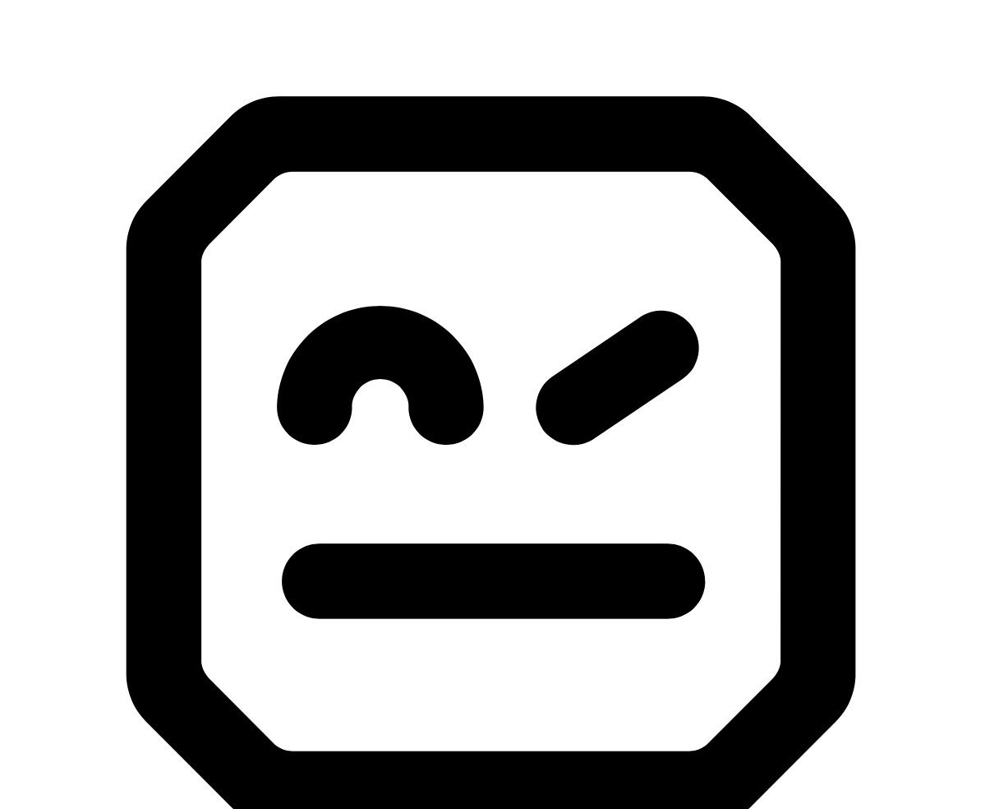

# Hi there , I am Venka!

I am a **Quality Assurance Engineer** in **Government Technology Agency** Singapore.

Practising as a QA, Automation Engineer and Incident support.
----

🧰 Toolbox

    

* Robot
  * [Getting Started](Robot/Getting%20Started)
  * [Introduction](Robot/Introduction)
  * [Installation](Robot/Installation)
  * [Automation](Robot/Automation)  
* Frequently Asked Questions
  * [General](FAQs/General)
  * [Automation](FAQs/Account)
  

